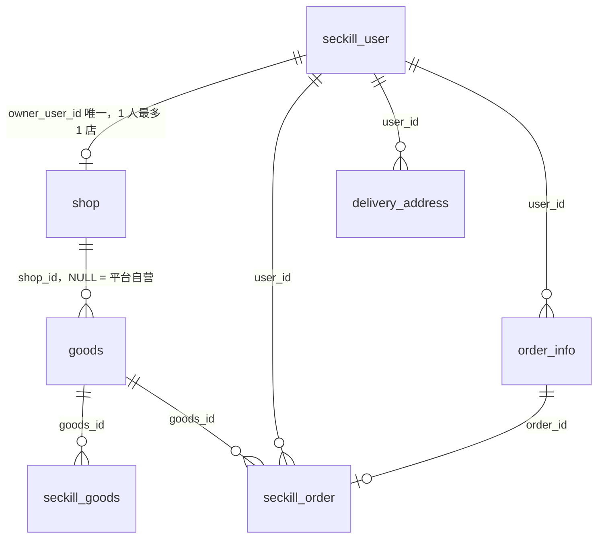

# 闪惠智购商城 — 高并发秒杀 + AI 导购平台

基于 **SpringBoot、MyBatis、Redis、RabbitMQ、Claude AI** 构建的高并发秒杀商城，解决了缓存预热、流量削峰、异步落库、防超卖等核心问题，并集成 AI 导购模块，支持流式对话与个性化商品推荐。

### 项目特点：
- **高并发秒杀处理**：采用多线程异步处理和缓存技术。
- **分布式架构支持**：支持横向扩展，分布式部署。
- **异步下单与消息队列**：使用 RabbitMQ 完成订单异步处理。
- **安全性优化**：双重 MD5 加密、验证码校验、限流防刷。
- **缓存优化**：利用 Redis 缓存秒杀商品和用户信息，减少数据库负担。
- **页面静态化**：缓存秒杀页面到浏览器，减少服务器压力。

## 技术架构图

系统架构与链路说明见 `doc/技术文档.md`。

高并发优化路线和分阶段验收标准见 `doc/高并发优化计划.md`。

### 核心数据模型（含商家体系）



-   角色：`seckill_user.role` = 0 普通用户 / 1 商家 / 9 平台管理员；平台管理员另有独立的 `admin_user` 表。
-   商家经平台审核后开店（`shop.status` = 0 待审核 / 1 营业中 / 2 停用），商品通过 `goods.shop_id` 归属店铺，NULL 表示平台自营。
-   秒杀订单 `seckill_order` 通过唯一索引 `(user_id, goods_id)` 兜底防重复下单，并通过 `order_id` 关联 `order_info` 支付/履约主表。

## 运行环境

| JDK  | Maven | MySQL | SpringBoot     | Redis | RabbitMQ |
|------|-------|-------|----------------|-------|----------|
| 1.8  | 3.9.6 | 8     | 2.3.12.RELEASE | 3.2   | 3.7.14   |

## 使用说明

### 1. 克隆项目：
```bash
git clone https://github.com/pitt1997/seckill
```

### 2. 配置数据库：
-   安装启动 MySQL 数据库。
-   新库按 `sql/readme.sql` 初始化；已有数据库只执行 `sql/migration/upgrade_to_current.sql`，不要再拆分执行历史迁移脚本。
-   本地演示可直接使用 `application.properties` 的默认值；部署环境建议通过环境变量覆盖连接信息：
    `DB_URL`、`DB_USERNAME`、`DB_PASSWORD`、`REDIS_HOST`、`REDIS_PORT`、`REDIS_PASSWORD`、
    `RABBITMQ_HOST`、`RABBITMQ_PORT`、`RABBITMQ_USERNAME`、`RABBITMQ_PASSWORD`、`RABBITMQ_VHOST`。

### 3. 配置依赖服务：

-   需要提前安装并启动 Redis 和 RabbitMQ 服务，确保项目能正确连接。

-   AI 导购使用 `CLAUDE_API_KEY` 配置密钥；未配置时页面仍可打开，但对话会返回降级提示。HTTPS 部署时设置 `COOKIE_SECURE=true`。

-   浏览器写操作启用双提交 CSRF 保护：服务端下发 `XSRF-TOKEN` Cookie，前端自动发送 `X-XSRF-TOKEN` 请求头；接口客户端使用 `Authorization` 时可不携带该 Cookie。

### 4. 启动项目：

-   导入项目到 **IntelliJ IDEA** 中。

-   运行 `SeckillApplication.java` 启动 SpringBoot 项目。

-   访问秒杀系统：

    -   登录地址：<http://localhost:8080/login/index>
    -   商品秒杀列表：<http://localhost:8080/goods/list>

### 5. 测试数据：

-   数据库中已提供1000个用户（手机号：15200000000~15200000997，密码为：123456）。
-   使用 `com.lijs.seckill.util.UserUtil` 可继续生成用户数据并进行压测。

### 6. 调整秒杀时间：

-   在数据库中调整秒杀商品的时间范围，确保秒杀活动按时启动。

### 7. 演示完整业务链路：

-   商品列表：`http://localhost:8080/goods/list`
-   我的订单：`http://localhost:8080/order_list.htm`
-   收货地址：`http://localhost:8080/address.htm`
-   管理后台：`http://localhost:8080/admin.htm`
-   商家后台：`http://localhost:8080/merchant.htm`（普通用户可提交入驻申请，平台审核通过后开通商家角色，管理自家店铺商品）
-   秒杀成功后可在订单详情页完成模拟支付；管理员发货后，用户可在“我的订单”中确认收货并完成订单。已支付订单也可提交退款申请，由管理员在后台审核通过后标记为已退款（演示流程不接触真实资金）。
-   管理员账户不会写入默认密码。请按 `sql/migration/README.md` 的说明，用 `MD5Util.inputPassToDbPass` 生成密码后插入 `admin_user` 表，再登录管理后台。

> 演示环境建议将 `seckill_goods.start_date` 设置为当前时间前几分钟、`end_date` 设置为当前时间后 30 分钟，并准备至少一条收货地址。秒杀时间由服务端校验，前端倒计时仅用于展示。

### 8. 推荐演示初始化顺序：

1. 执行基础建表脚本及 `sql/migration/upgrade_to_current.sql`。
2. 执行 `sql/demo_seed.sql`，将商品 1 设置为进行中、商品 2 设置为未开始、商品 3 设置为已结束，并为演示用户准备默认收货地址。
3. 启动 Redis、RabbitMQ 和应用，使用手机号 `15008888888` 登录，密码沿用基础用户脚本中的测试密码 `123456`。
4. 打开商品列表完成一遍秒杀、支付、发货、收货流程。管理员密码仍需按 V4 说明单独生成，不在脚本中写入默认密码。

## 压力测试与性能结果

### 测试环境：

-   **JDK**: 1.8
-   **Maven**: 3.9.6
-   **MySQL**: 8
-   **Redis**: 3.2
-   **RabbitMQ**: 3.7.14
-   **测试工具**: JMeter

### 测试用例：

-   **用户数量**: 1000
-   **请求并发量**: 5000
-   **测试时间**: 10分钟
-   **请求类型**: 秒杀请求

### 测试结果：

-   **QPS（每秒处理请求数）** : 1500
-   **平均响应时间**: 150ms
-   **成功请求率**: 99.8%
-   **失败请求率**: 0.2%

### 性能瓶颈分析：

-   数据库查询响应时间较长，建议进一步优化查询语句。
-   Redis 缓存命中率较高，提升了系统的并发处理能力。
-   消息队列成功削峰，避免了系统宕机。

### 解决方案：

-   增强数据库性能，使用分布式数据库。
-   优化消息队列的消费者处理速度。

## 系统功能

### 1. 用户模块

-   **用户注册与登录**：支持手机号登录，采用双重 MD5 加密密码。
-   **验证码验证**：秒杀接口有验证码限制，防止恶意攻击。

### 2. 秒杀模块

-   **商品秒杀**：展示秒杀商品，提供秒杀按钮，用户可以在规定时间内参与秒杀。
-   **秒杀倒计时**：展示秒杀商品的剩余时间。
-   **秒杀结果展示**：秒杀成功或失败后的结果展示页面。

### 3. 管理员模块

-   **秒杀商品管理**：管理员可以增加、修改商品资料和秒杀时间；已有商品的库存通过“补货”操作增加，编辑资料不会覆盖秒杀剩余库存。
-   **用户管理**：管理员可以查看所有用户的秒杀记录。
-   **店铺审核**：审核商家入驻申请（通过后授予商家角色）、停用/恢复店铺。

### 4. 商家模块

-   **入驻申请**：普通用户提交店铺名称与简介，等待平台审核（`/merchant.htm`）。
-   **商品管理**：商家可发布、编辑自家店铺的秒杀商品与活动时间，库存通过“补货”操作增加。
-   **权限隔离**：商家只能操作 `shop_id` 等于自己店铺的商品，服务端对每次写操作做归属校验。

## 安全设计

### 平台级管理员 + 商家级权限隔离

| 角色 | 判定依据 | 入口 | 权限范围 |
|------|----------|------|----------|
| 普通用户 | `seckill_user.role` = 0 | 商城前台 | 秒杀下单、订单、收货地址、提交商家入驻申请 |
| 商家 | `seckill_user.role` = 1 且店铺营业中 | `/merchant.htm` + `/merchant/*` | 只能管理自己店铺（`goods.shop_id` 匹配）的商品 |
| 平台管理员 | `admin_user` 表 + `X-Admin-Token` 请求头 | `/admin.htm` + `/admin/*` | 店铺审核、全平台商品/订单/发货/退款管理 |

商家接口的防护链路（`MerchantController` + `AdminGoodsService`）：

1. **登录校验**：解析分布式 Session，未登录返回 `SESSION_ERROR`；
2. **入驻校验**：无店铺记录或审核未通过时拒绝进入（待审核/停用有对应提示）；
3. **营业状态校验**：店铺 `status != 1` 不可进行任何操作；
4. **服务端归属校验**：每次商品写操作调用 `checkShopScope` 核对 `goods.shop_id`，不属于当前商家则返回 `GOODS_FORBIDDEN(500516)`——前端被绕过伪造参数也无法改动他人商品（已用负向冒烟用例验证：商家 B 修改商家 A 的商品被拦截且数据未变）。

其他安全基线：双重 MD5 + 随机盐存密、token 走 HttpOnly Cookie（浏览器）或 `Authorization` 头（API）、写操作双提交 CSRF 保护、公开接口 `@AccessLimit` 限流。

## 缓存防御

### 缓存穿透（已落地）

-   **风险**：`GET /goods/detailStatic/{goodsId}` 是无缓存的公开接口，脚本可用不存在的 ID 持续刷库。
-   **解法**：
    1. 接口入口加 `@AccessLimit(seconds = 1, maxCount = 10, needLogin = false)`，按 IP 每秒最多 10 次；
    2. DB 查不到的 ID 写入 60s 空值缓存（`GoodsKey:gn{goodsId}`），后续请求直接短路返回 `GOODS_NOT_EXIST`，不再落到 DB。
-   不引入布隆过滤器：单体 MVP 场景下性价比低（杀鸡用牛刀）。

### 缓存击穿（已落地）

-   **风险**：商品列表页 HTML 缓存（`GoodsKey:gl`，TTL 60s）恰好过期瞬间，高并发请求同时查库 + 渲染模板，可能打满 DB 连接池。
-   **解法**：SETNX 单飞锁（`GoodsKey:gll`，TTL 5s，`RedisService.setIfAbsent`）——
    - 抢到锁的请求负责查库、渲染并写回缓存，`finally` 中释放锁（渲染失败也会释放，避免锁悬挂）；
    - 未抢到锁的请求 `sleep 100ms` 后重试读缓存；若仍未命中则降级为自行渲染，保证接口始终可用。

### 缓存雪崩（暂不处理）

-   热 key 只有列表页缓存一个（TTL 60s），不存在大量 key 同时过期；秒杀库存 key（`GoodsKey:gs`）永不过期且启动时预热（`setIfAbsent`，重启不会覆盖已扣减的库存）。
-   后续可选加固：Redis 连接配置 200ms 级超时，实现快速失败 + 降级兜底，当前 MVP 阶段不引入。

* * *

---
